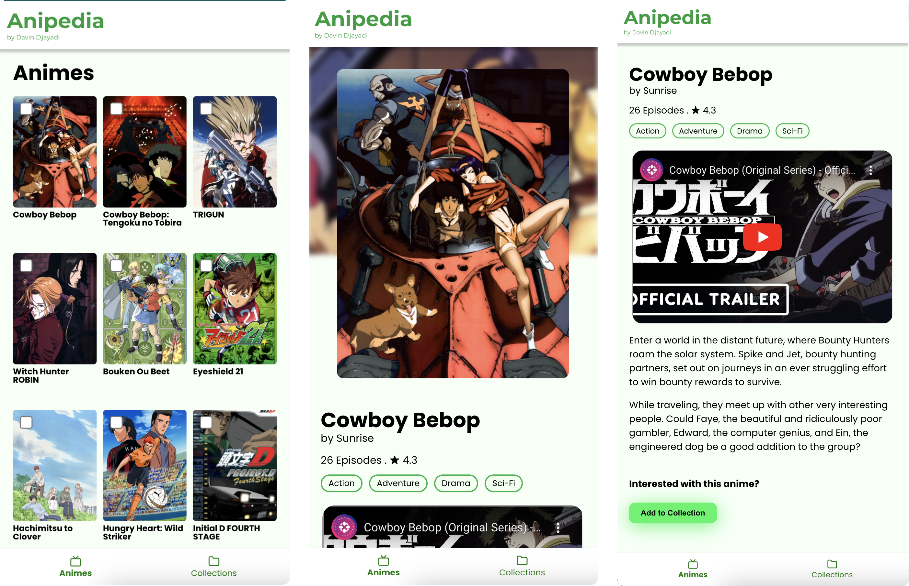
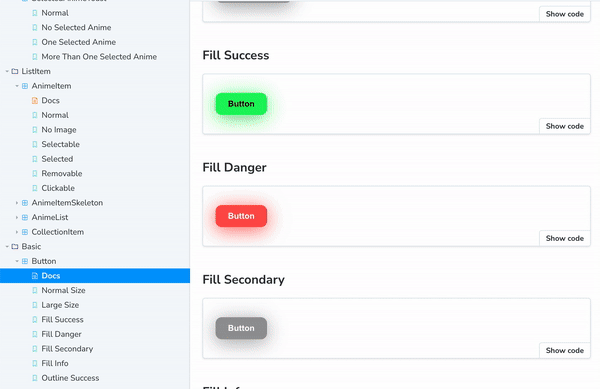
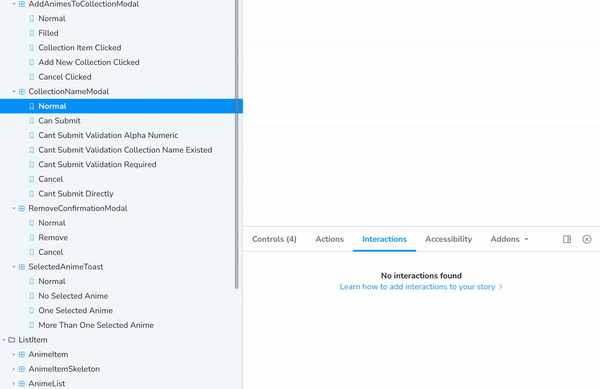
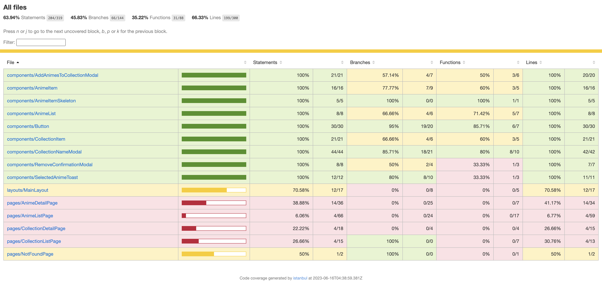

     

# Anipedia 

Anipedia is an Anime Encylopedia web application that utilize [Anilist API](https://anilist.gitbook.io/anilist-apiv2-docs/). in this application user can browse animes, learn deeper about anime, and save anime to collections.

## 👁️ Project Preview


This project is also hosted and can be viewed in this link:  
https://anipedia-vynncode.netlify.app/

## 🧬 Tech Stack

here are some technologies I use to make this project

- [React](https://react.dev/). frontend framework.
- [Apollo](https://www.apollographql.com/). fetch QraphQL API
- [Emotion](https://emotion.sh/docs/introduction). CSS in JS library
- [Jest](https://jestjs.io/). unit testing framework
- [Testing Library](https://testing-library.com/). UI Testing library
- [Storybook](https://storybook.js.org/). frontend workshop for building UI components in isolation.

## ⚙️ Installation

Follow these steps if you want to run this project on your local machine.

1. download / clone this repo.

```sh
$ git clone github.com/davindj/anipedia
```

2. go to project directory and install package using your favorite javascript package manager.

```sh
# my favorite
$ yarn
```

3. run the project to make sure installation working properly

```sh
$ yarn start
```

## 📕 Storybook

Storybook is utility tools to develop UI component in Isolated way, so that developer can focus on breakdowning component and make sure is working properly.  
  
To use storybook in this project you can simply run this command. (assuming your installation is working fine)

```sh
$ yarn storybook
```

## 🧪 Testing

Storybook can also be used for UI testing also called interaction testing. Storybook itself make use of Jest and Testing Library to make this happen.

In this tools you can visualize your UI testing script and also debug step by step, make it easier and faster to recognize problem.  


Not only does UI testing run in UI. Storybook testing can also be run in cli using this command.

> _make sure your storybook is running before run this command_

```sh
yarn test-storybook
```

If you want to get code coverage you run this command.

```sh
yarn test-storybook:coverage
```

coverage will be output'd at `/coverage/storybook` and for html version you can look up in `/coverage/storybook/lcov-report/index.html`.

Currently here is the code coverage result:

<sup>coverage at 14:35 16 June 2023</sup>  
The result is <strong>63.94%</strong> for all statements. This happen because pages component in this project are not tested yet.

## 🏭 Production

To build this app for production you can simply run this command

```sh
$ yarn build
```

and run it using server utility programs like [serve](https://yarnpkg.com/package/serve)

```sh
$ serve -s build
```
